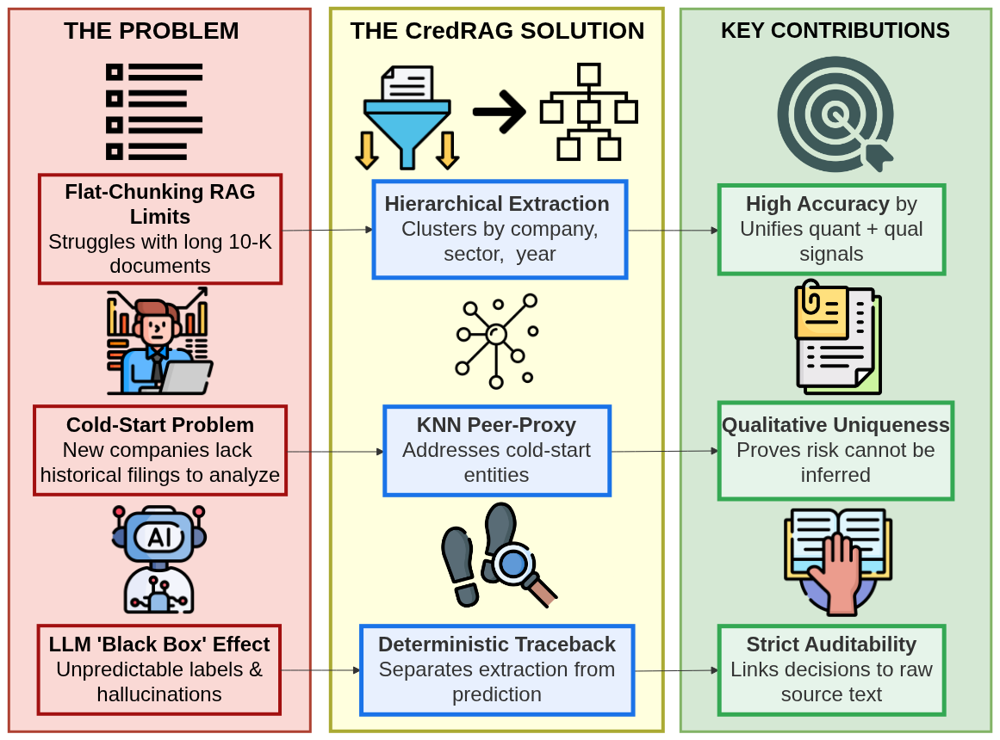
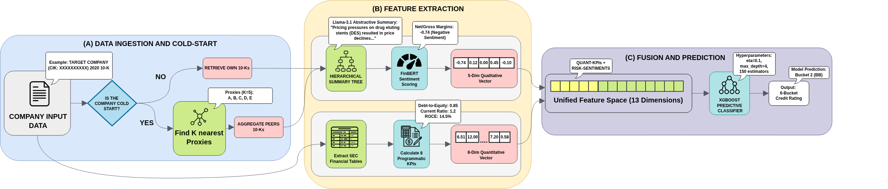
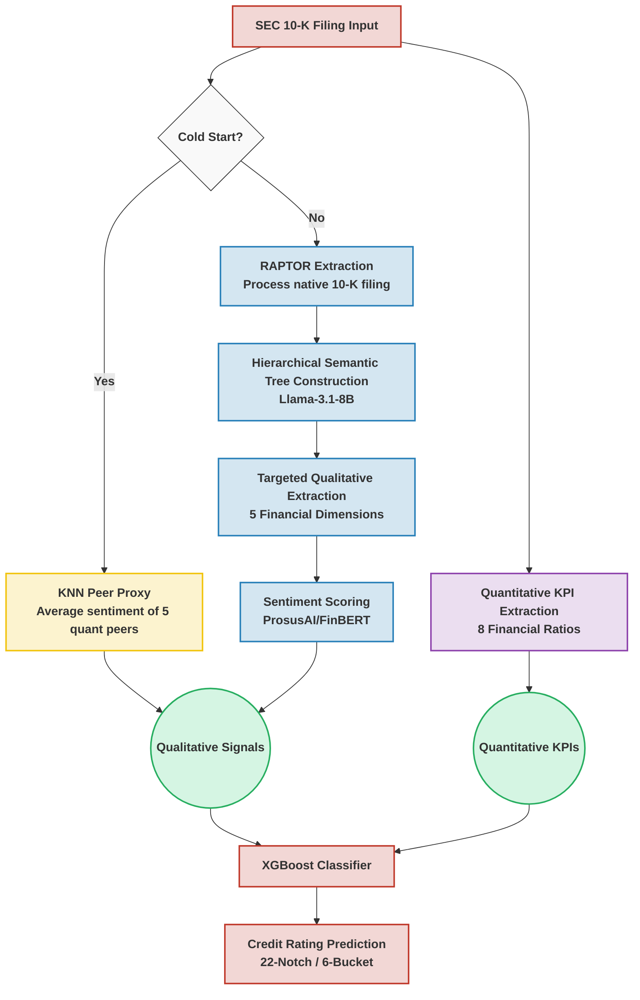
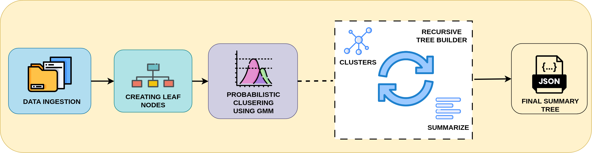
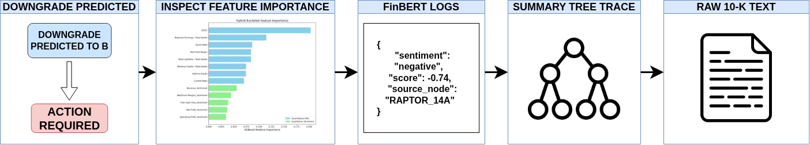

# CredRAG

**A Hierarchical RAG-based LLM Pipeline for Corporate Credit Risk Assessment**

> *Anonymized for Double-Blind Peer Review*

---

## Overview

CredRAG is an end-to-end AI pipeline that automates corporate credit score prediction by combining qualitative sentiment extracted from unstructured SEC 10-K filings with traditional quantitative financial metrics. It addresses the "black-box" nature of Large Language Models (LLMs) in finance by employing a hierarchical Retrieval-Augmented Generation (RAG) architecture that maintains a deterministic, backward-chaining audit trail from the final credit prediction all the way back to the raw source text.

  

---

## Performance Highlights

Our empirical evaluation on a dataset of 2,349 SEC filings demonstrates that CredRAG significantly outperforms traditional quantitative baselines and standard flat-chunking RAG approaches:

- **22-Notch Granular Scale**: Peak accuracy of **63.07%** (up from 58.51% quant baseline).
- **6-Bucket Macro Scale**: Peak accuracy of **81.20%**.
- **Within-1-Notch Accuracy**: **88.38%** of predictions were either exactly correct or within a single rating notch.
- **Mean Absolute Error (MAE)**: Reduced to **0.518** notches.

### Model Performance Comparison (22-Notch Scale)

| Model Strategy | Macro Accuracy | MAE | Within-1-Bucket | Weighted F1 |
|:---|:---:|:---:|:---:|:---:|
| **Baseline (Quant Only)** | 58.51% | 0.618 | 83.82% | 0.5966 |
| **Naive RAG (Quant+Flat Text)** | 54.17% | 0.667 | 79.17% | 0.5378 |
| **Hierarchical RAG (Quant+Tree Text)** | **63.07%** | **0.518** | **88.38%** | **0.6371** |

### Retrieval Evaluation (Conceptual Abstraction)

| Pipeline | Precision | Recall | Relevance |
|:---|:---:|:---:|:---:|
| **Naive RAG** | 80.0% | 64.0% | 50.0% |
| **Hierarchical RAG** | **88.0%** | **74.0%** | **56.0%** |

---

## Pipeline Architecture

  

---

## Core Components

### 1. Quantitative KPI Extraction
To establish a robust mathematical baseline, 8 programmatic financial KPIs (including Current Ratio, Debt-to-Equity, ROCE) are deterministically extracted from the XBRL tabular data of SEC filings using a heuristic-based parsing algorithm.

### 2. Qualitative Extraction via RAPTOR
Standard flat-chunking RAG pipelines fail to capture filing-wide thematic risks. CredRAG utilizes a modified [RAPTOR](https://arxiv.org/abs/2401.18059) (Recursive Abstractive Processing for Tree-Organized Retrieval) pipeline:
- Filings are segmented into 512-token chunks and embedded using `yixuantt/Fin-E5`.
- Chunks are clustered using Gaussian Mixture Models (GMM) and recursively summarized by a locally hosted `meta-llama/Llama-3.1-8B-Instruct` model to build a bottom-up semantic tree.
- The model extracts narratives across five targeted dimensions: **Revenue, Operating Profit, Net/Gross Margins, Net Profit, and Free Cash Flow**.
- Extracted summaries are scored for financial sentiment using `ProsusAI/finbert`.

  

### 3. Credit Rating Prediction
The extracted qualitative sentiment vectors and quantitative KPIs are fused and fed into an **XGBoost** classifier, optimized for multi-class ordinal classification across a standard 22-notch rating scale (AAA to D).

### 4. Cold-Start Peer Proxying
For companies lacking sufficient institutional filing history (cold-start), CredRAG employs a K-Nearest Neighbors (KNN) algorithm. The system maps the company to its 5 closest peers (via Euclidean distance on industry quantitative features) and averages their pre-computed qualitative sentiment vectors. Our ablation studies prove that while this establishes a baseline, native qualitative disclosures are highly idiosyncratic and cannot be perfectly proxied.

---

## Auditability & Traceability

A critical requirement for deployment in financial institutions is explainability. CredRAG is designed with a strict deterministic traceback mechanism:
1. Risk analysts can view the XGBoost feature importance (e.g., observing a downgrade driven by `Revenue_Sentiment`).
2. They can query the pipeline logs to retrieve the exact intermediate qualitative summary generated by Llama-3.1.
3. The RAPTOR retrieval logs map that summary directly back to the specific contiguous text chunks in the original SEC 10-K filing.

  

This backward-chaining completely eliminates the LLM "black-box" effect and ensures full compliance with institutional audit requirements.

---

## References
1. Sarthi et al., "RAPTOR: Recursive abstractive processing for tree-organized retrieval," *ICLR 2024*.
2. *(Add your paper citation here upon publication)*
